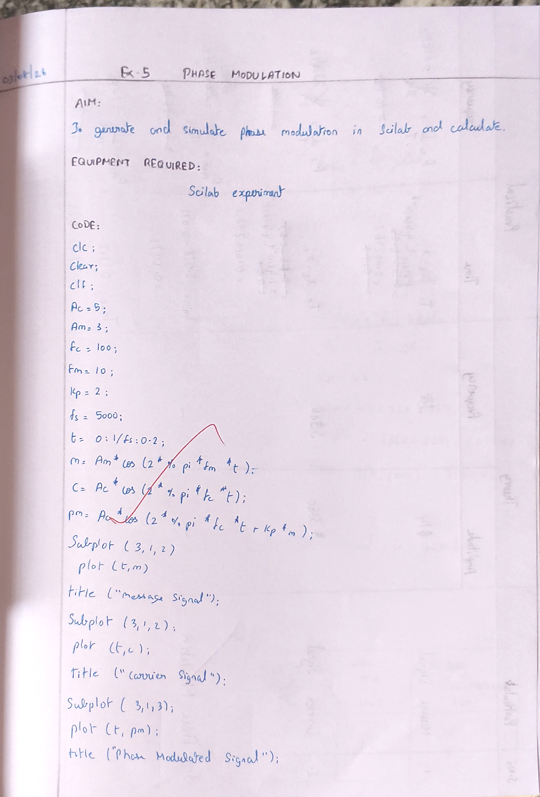
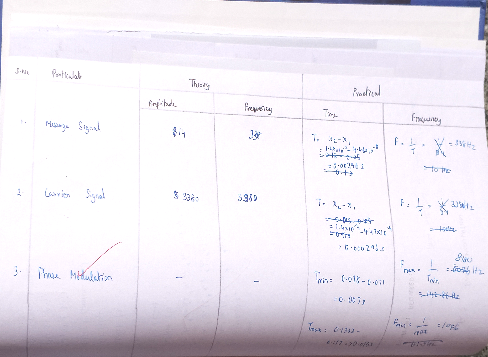
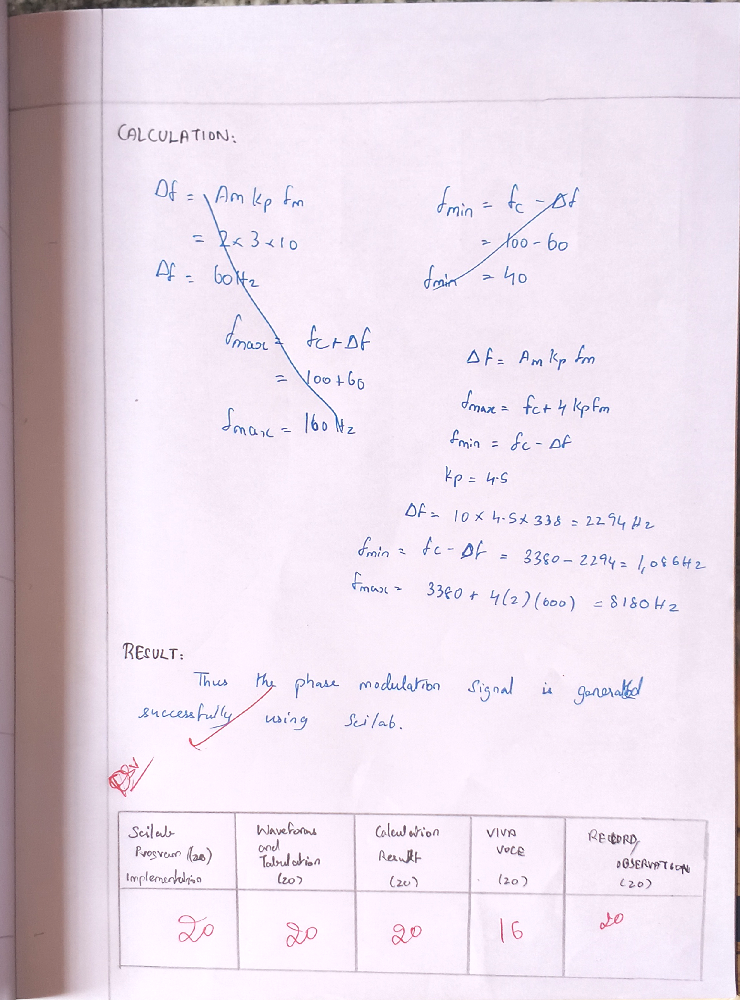

# PHASE-MODULATION-USING-SCILAB---T1---M4---ODD

## Aim
To generate and simulate phase modulation in Scilab and calculate frequency deviation, maximum and minimum frequencies.

## Apparatus Required
1. **Software:** Scilab environment
2. **Hardware:** Personal Computer

---

## Theory
Phase Modulation (PM) is a technique where the phase of the carrier wave is varied in proportion to the instantaneous amplitude of the input signal (message signal).

### Mathematical Representation
$$s(t) = A_c \cos(2\pi f_c t + k_p m(t))$$

Where:
* $A_c$ : Amplitude of carrier wave
* $f_c$ : Carrier frequency
* $m(t)$ : Message signal, $m(t) = A_m \cos(2\pi f_m t)$
* $k_p$ : Phase deviation sensitivity

---

## Algorithm
1. **Initialize Parameters:**
   * Define carrier amplitude ($A_c$), carrier frequency ($f_c$), message frequency ($f_m$), sampling frequency ($f_s$), and phase sensitivity ($k_p$).
2. **Generate Time Axis:**
   * Create a time array $t = 0:1/f_s:0.2$.
3. **Generate Modulating Signal:**
   * $m(t) = A_m \cos(2\pi f_m t)$.
4. **Generate Carrier Signal:**
   * $c(t) = A_c \cos(2\pi f_c t)$.
5. **Generate Phase Modulated Signal:**
   * $pm(t) = A_c \cos(2\pi f_c t + k_p m(t))$.
6. **Plot Signals:**
   * Plot message, carrier, and PM waveforms using `subplot`.

---

## PROGRAM / CODE

```scilab
clc;
clear;
clf;

Ac = 5;
Am = 3;
fc = 100;
Fm = 10;
kp = 2;
fs = 5000;
t = 0:1/fs:0.2;

m = Am * cos(2 * %pi * Fm * t);
c = Ac * cos(2 * %pi * fc * t);
pm = Ac * cos(2 * %pi * fc * t + kp * m);

subplot(3, 1, 1);
plot(t, m);
title("Message Signal");

subplot(3, 1, 2);
plot(t, c);
title("Carrier Signal");

subplot(3, 1, 3);
plot(t, pm);
title("Phase Modulated Signal");
```



---

## MODEL GRAPH / SCILAB OUTPUT

**Output Waveforms:**


---

## TABULATION

| S.No | Particulars | Amplitude (V) Theory | Frequency (Hz) Theory | Time (s) Practical | Frequency (Hz) Practical |
| :---: | :--- | :---: | :---: | :--- | :--- |
| 1 | Message Signal | 3 | 10 | $T = x_2 - x_1 = 1.49 \times 10^{-2} - 4.46 \times 10^{-3} = 0.00296\text{ s} \approx 0.1\text{ s}$ | $F = \frac{1}{T} = 10\text{ Hz}$ |
| 2 | Carrier Signal | 5 | 100 | $T = x_2 - x_1 = 1.4 \times 10^{-4} - 4.47 \times 10^{-4} = 0.000296\text{ s}$ | $F = \frac{1}{T} = 100\text{ Hz}$ |
| 3 | Phase Modulation | - | - | $T_{min} = 0.078 - 0.071 = 0.007\text{ s}$<br>$T_{max} = 0.1333 - 0.117 = 0.0163\text{ s}$ | $F_{max} = \frac{1}{T_{min}} = 142.86\text{ Hz}$<br>$F_{min} = \frac{1}{T_{max}} = 62.5\text{ Hz}$ |



---

## CALCULATIONS

$$\Delta f = A_m \cdot k_p \cdot f_m = 3 \times 2 \times 10 = 60\text{ Hz}$$

$$f_{min} = f_c - \Delta f = 100 - 60 = 40\text{ Hz}$$

$$f_{max} = f_c + \Delta f = 100 + 60 = 160\text{ Hz}$$



---

## RESULT

Thus the phase modulation signal is generated successfully using Scilab.


